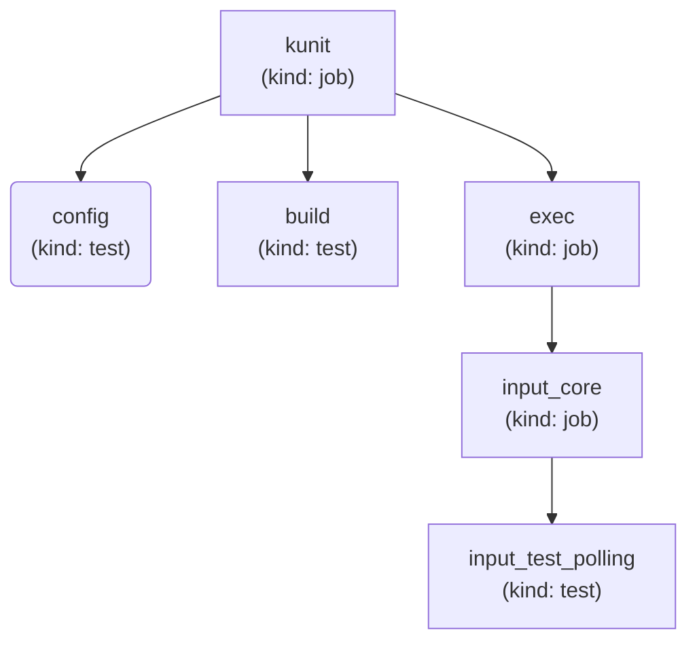
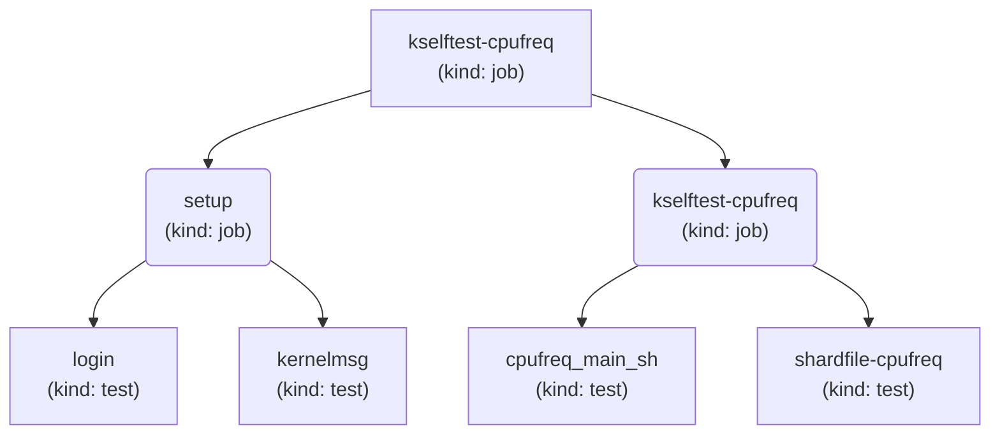
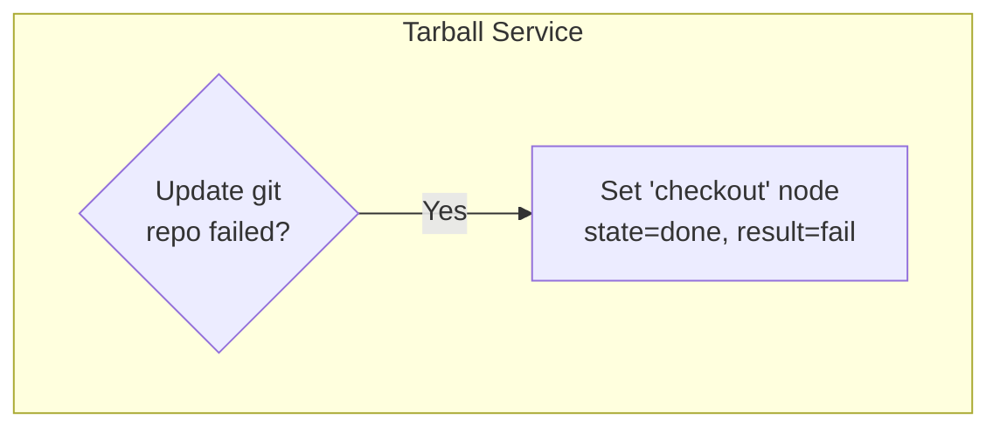
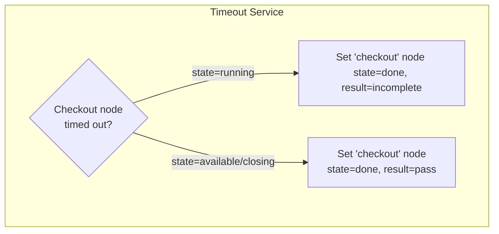
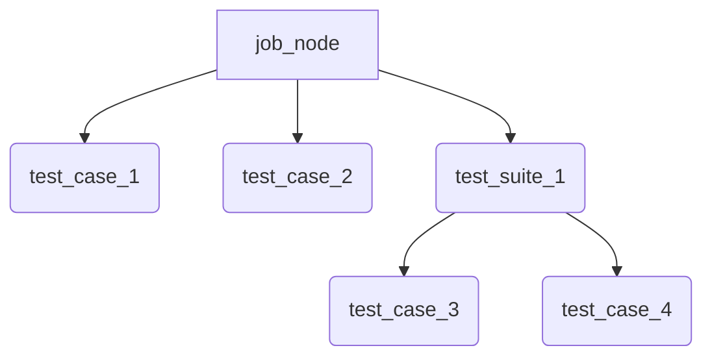
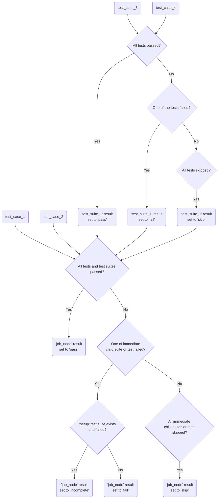

## Enabling new Kernel trees, builds, and tests

We can monitor different kernel trees in KernelCI. The builds and test jobs are triggered whenever the specified branches are updated.
This manual describes how to enable trees in [`kernelci-pipeline`](https://github.com/kernelci/kernelci-pipeline.git).


### Pipeline configuration
The pipeline [trees](https://github.com/kernelci/kernelci-pipeline/blob/main/config/trees.yaml) configuration file has `trees` section.
In order to enable a new tree, we need to add an entry there.

```yaml
trees:
  <tree-name>:
    url: "<tree-url>"
```
For example,
```yaml
trees:
  kernelci:
    url: "https://github.com/kernelci/linux.git"
```

The `<tree-name>` will be used in the other sections to refer to the newly added tree.

After adding a `trees` entry, we need to define build and test configurations for it. In the same [jobs](https://github.com/kernelci/kernelci-pipeline/blob/main/config/jobs.yaml) cofiguration file, the `jobs` section is there to specify them. `ChromeOS` specific job definitions are located in [config/jobs-chromeos.yaml](https://github.com/kernelci/kernelci-pipeline/blob/main/config/jobs-chromeos.yaml) file. Depending upon the type of the job such as build or test job, different parameters are specified:

For instance,
```yaml
jobs:

  <kbuild-job-name>:
    template: <job-template>
    kind: kbuild
    image: <docker-image-name>
    params:
      arch: <architecture>
      compiler: <compiler-name>
      cross_compile: <compiler-prefix>
      dtbs_check: <dtb-check-enabled>
      defconfig: <defconfig-name>
      fragments:
       - <fragment-name>
    rules:
      min_version:
        version: <kernel-version>
        patchlevel: <kernel-patch_level>
      tree:
        - <tree-name>
        - !<tree-name2>
      branch:
        - <branch-name>

  <test-job-name>:
    template: <template-name>
    kind: <kind of job, either 'job' or 'test'>
    params:
      nfsroot: <rootfs-url>
      collections: <name-of-suite>
      job_timeout: <timeout>
    kcidb_test_suite: <kcidb-mapping>
    rules:
      min_version:
        version: <kernel-version>
        patchlevel: <kernel-patch-level>
      tree:
        - <tree-name>
        - !<tree-name2>
        - <tree-name3>:<branch-name>
```
Here is the description of each field:
- **`template`**: A `jinja2` template should be added to the [`config/runtime`](https://github.com/kernelci/kernelci-pipeline/tree/main/config/runtime) directory. This template will be used to generate the test definition.
- **`kind`**: The `kind` field specifies the type of job. It should be `kbuild` for build jobs, `job` for a test suite, `process` for post-processing tasks (for example coverage reports), and `test` for a single test case.
- **`image`**: The `image` field specifies the Docker image used for building and running the test. This field is optional. For example, LAVA test jobs use an image defined in the test definition template instead.
- **`params`**: The `params` field includes parameters for building the kernel (for `kbuild` jobs) or running the test. These parameters can include architecture, compiler, defconfig options, job timeout, etc.
- **`rules`**: The `rules` field defines job rules. If a test should be scheduled for a specific kernel tree, branch, or version, these rules can be specified here. The rules prefixed with `!` exclude the specified condition from job scheduling. For example, in the given scenario, the scheduler does not schedule a job if an event is received for the kernel tree `tree-name2`. It is also possible to schedule job for a specific branch of a tree. For example, a rule `tree:branch` can be mentioned under
`tree` or `branch` section to define that, still accepting the `!` prefix to ensure jobs can be scheduled on all branches from a given tree, except a few select ones.
Rules can be defined in relation to any attribute present in the parent node (such as `defconfig` or `fragments` or even `arch` for test jobs having a parent node of `kbuild` type).
`min_version` and `max_version` are special cases to allow jobs to run only on given kernel versions.
- **`kcidb_test_suite`**: The `kcidb_test_suite` field maps the KernelCI test suite name with the KCIDB test. This field is not required for build jobs (`kind: kbuild`). When adding new tests, ensure their definition is present in the `tests.yaml` file in [KCIDB](https://github.com/kernelci/kcidb/blob/main/tests.yaml).

Common patterns are often defined using YAML anchors and aliases. This approach allows for concise job definitions by reusing existing configurations. For example, a kbuild job can be defined as follows:
```yaml
  kbuild-gcc-12-arm64-preempt_rt_chromebook:
    <<: *kbuild-gcc-12-arm64-job
    params:
      <<: *kbuild-gcc-12-arm64-params
      fragments:
       - 'preempt_rt'
       - 'arm64-chromebook'
      defconfig: defconfig
    rules:
      tree:
      - 'stable-rt'
```
The test job example is:
```yaml
  kselftest-exec:
    template: generic.jinja2
    kind: job
    params:
      test_method: kselftest
      nfsroot: 'https://storage.kernelci.org/images/rootfs/debian/bookworm-kselftest/20250724.0/{debarch}'
      collections: exec
      job_timeout: 10
    kcidb_test_suite: kselftest.exec
```
Whenever possible reuse the existing YAML anchors (for example `*kselftest-params`) instead of cloning the full `params` block so that shared settings such as the `nfsroot` URL stay in sync with the canonical definition in `config/jobs.yaml`.
Please have a look at [config/jobs.yaml](https://github.com/kernelci/kernelci-pipeline/blob/main/config/jobs.yaml) and [config/jobs-chromeos.yaml](https://github.com/kernelci/kernelci-pipeline/blob/main/config/jobs-chromeos.yaml) files to check currently added job definitions for reference.

We need to specify which branch to monitor of a particular tree for trigering jobs in `build_configs`.

```yaml
build_configs:
  <name-of-variant0>:
    tree: <tree-name>
    branch: <branch-name0>

  <name-of-variant1>:
    tree: <tree-name>
    branch: <branch-name1>
```

That's it! The tree is enabled now. All the jobs defined under `jobs` section of [config file](https://github.com/kernelci/kernelci-pipeline/blob/main/config/jobs.yaml) would run on the specified branched for this tree.

### Schedule the job

We also need a `scheduler` entry in [config/scheduler.yaml](https://github.com/kernelci/kernelci-pipeline/blob/main/config/scheduler.yaml) for the newly added job to specify pre-conditions for scheduling, and defining runtime and platforms for job submissions. 

For example,
```yaml
scheduler:

  - job: <kbuild-job-name>
    event: <API-pubsub-event>
    runtime:
      name: <runtime-name>

  - job: <test-job-name>
    event: <API-pubsub-event>
    runtime:
      type: <runtime-type>
      name: <runtime-name>
    platforms:
      - <device-type>
```

Here is the description of each field:
- **`job`**: Specifies the job name, which must match the name used in the `jobs` section.
- **`event`**: Specifies the API PubSub event triggering the test scheduling. For example, to trigger the `kbuild` job when new source code is published, the event is specified as:
```yaml
  event:
    channel: node
    name: checkout
    state: available
```
For a test that requires a successful completion of a build job such as `kbuild-gcc-12-arm64`, specify the event as follows:
```yaml
  event:
    channel: node
    name: kbuild-gcc-12-arm64
    state: available
```
For a post-processing job that requires completion of all test jobs for a given build job such as `kbuild-gcc-12-arm64`, specify the event as follows:
```yaml
  event:
    channel: node
    name: kbuild-gcc-12-arm64
    result: pass
    state: done
```
Here, `node` refers to the name of API PubSub channel where node events are published.
- **`runtime`**: Select a runtime for scheduling and running the job. Supported runtimes include `shell`, `docker`, `lava`, and `kubernetes`. Specify the runtime type from the `runtimes` section. Note that the `name` property is required for `lava` and `kubernetes` runtimes to specify which lab or Kubernetes context should execute the test. Several LAVA labs (such as BayLibre, Collabora, Qualcomm) and Kubernetes contexts have been enabled in KernelCI.
- **`platforms`**: Includes a list of device types on which the test should run. These should match entries defined in the `platforms` section, such as `qemu-x86`, `bcm2711-rpi-4-b`, and others.

After following these steps, run your pipeline instance to activate your newly added test configuration.

### An example of enabling a new job

Here is an example of enabling `kselftest` (found in `<linux_kernel>/tools/testing/selftests`) job. Most parameters are already set for other kselftests. Those must be reused while enabling new kselftests which makes enabling new tests pretty straight forward. The `dt` kselftest suite can be enabled by:

1. Create a job definition in `jobs` section.
```
  kselftest-dt:
    template: generic.jinja2
    kind: job
    params:
      test_method: kselftest
      nfsroot: 'https://storage.kernelci.org/images/rootfs/debian/bookworm-kselftest/20250724.0/{debarch}'
      collections: dt
      job_timeout: 10
    rules:
      min_version:
        version: 6
        patchlevel: 7
    kcidb_test_suite: kselftest.dt
```
2. Create a `scheduler` entry for `kselftest-dt` job. Let's schedule this suite in `lava-collabora` lab at `kbuild-gcc-12-arm64` build completion event. The entry by using already defined anchors would be:
```
  - job: kselftest-dt
    event: *kbuild-gcc-12-arm64-node-event
    runtime: *runtime-lava-collabora
    platforms:
      - bcm2711-rpi-4-b
```
There can be multiple entries for a suite in `scheduler` section with different `events`, `runtime` or `platform`.

## Test hierarchy

Once you enable tests for your desired Kernel tree, maestro will start
running tests and storing results in maestro DB. This section explains  how maestro structures test results hierarchy.

### Job vs Test

We can have a test suite or a single test case running in maestro.
Conceptually, we use the term `job` for test suites and `test` for a single test case.

For instance, Kernel version check i.e. `kver` test is a single test
returning directly `pass` or `fail` result. Hence, `kver` would directly
represent the result and won't have any child tests running. That's why we use node kind `test` for such tests.

Whereas we also have different test suites running. For example, `kunit`, `kselftest`, `rt-tests`, `baseline` (boot tests). These suites will have
child tests or child jobs. All the nodes with child jobs or test cases would be represented with node kind `job`.

Please check the [configuration](https://github.com/kernelci/kernelci-pipeline/blob/main/config/pipeline.yaml) file for various job and test definitions.
Jobs will have `kind: job` and test cases will have `kind: test` respectively.


### Visualize hierarchy

Here is a visual representation of test hierarchy in maestro.
As mentioned earlier, nodes with child jobs or tests will have `kind=job`
and test cases without any child node will have `kind=test`.

For example, `kunit` test hierarchy would look like below:



In the above example, the job node `kunit` is created first. It has a child
job and a test node. `exec` is a job node as it contains child test cases, whereas `build` and `config` are test cases without any sub-tests.


#### LAVA job hierarchy

As stated earlier, maestro supports different runtimes for tests, such as
docker, kubernetes, and LAVA.

We treat LAVA jobs a bit differently with respect to other jobs. All the
LAVA job nodes will have a `setup` test suite that runs pre-condition checks (e.g. test device login or generate tarball for `tast` test) before running the actual test definition.

Here is the test hierarchy for `kselftest-cpufreq` job:



In the above example, root node `kselftest-cpufreq` is the main job node.
It has two child nodes. One is a `setup` test suite as mentioned above, and another is a job node with the same name i.e. `kselftest-cpufreq` which is the actual test definition.
`kselftest-cpufreq` (child job node) will be executed only after `setup` test suite's successful execution.


## Checkout result evaluation

Maestro pipeline creates a `checkout` node i.e., root node whenever a new kernel revision is detected.
All the build and test jobs are created as child nodes of this root node.

Below is the explanation of `checkout` node result evaluation based on different conditions.

Tarball service creates/updates a local git repo and uses it to create a kernel source tarball for the new revision. It transits checkout node to `result=fail` if git repo update operation fails.


Timeout service is responsible for detecting timed-out nodes and transiting them to appropriate state/result based on child job status. Below is the visual representation of how the `checkout` node is handled by the service based on its state:



## Test result evaluation

This section is intended to explain how results are evaluated in maestro.
For test cases (job nodes with `kind: test`), it directly uses test results
i.e. `pass`, `fail`, or `skip` from the data received from the respective job.

In case of a test suite (job node with `kind: job`), maestro evaluates result based on child test suites and tests.

Let's take an example of a `job_node` with the following hierarchy:


Here is the visual representation of the result evaluation of the `job_node`:


The summary of how the result evaluated is:
A job node result will be set to
- `pass` if all its tests/test suites passed
- `fail` if one of its tests/test suites failed
- `skip` if all tests/test suites are skipped
- `incomplete` if setup test suite failed
