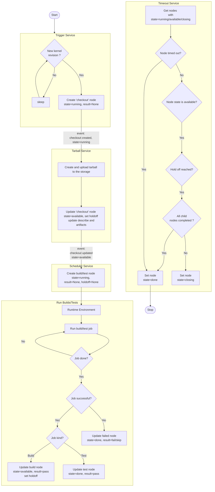

GitHub repository:
[`kernelci-pipeline`](https://github.com/kernelci/kernelci-pipeline.git)

Below is the detailed pipeline flow diagram with associated node and pub/sub event:

Here's a description of each client script:

### Trigger

The pipeline starts with the trigger script.
The Trigger periodically checks whether a new kernel revision has appeared
on a git branch.  If so, it firsts checks if API has already created a node with
the record. If not, it then pushes one node named "checkout". The node's state will be "available" and the result is not defined yet. This will generate pub/sub event of node creation.

### Tarball

When the trigger pushes a new revision node (checkout), the tarball receives a pub/sub event. The tarball then updates a local git checkout of the full kernel source tree.  Then it makes a tarball with the source code and pushes it to the API storage. The state of the checkout node will be updated to 'available' and the holdoff time will be set. The URL of the tarball is also added to the artifacts of the revision node.

### Scheduler

The Scheduler listens for pub/sub events about available checkout node. It will then create build or test nodes and submit them to the API based on the configuration in `config/scheduler.yaml`. A node is pushed to the API with "running" state (for example a `kunit` node), which generates an event that the runtimes consume.

### Runtime Environment

The jobs created by the scheduler will be run in the specified runtime environment i.e. shell, Kubernetes or LAVA lab.
Each environment needs to have its own API token set up locally to be able to submit the results to API. It updates the node with state ("available" or "done" depending on the job type) and result (pass, fail, or skip). This will generate pub/sub event of node update.

### Timeout

The timeout service periodically checks all nodes' state. If a node is not in "done" state, then it checks whether the maximum wait time (timeout) is over. If so, it sets the node and all its child nodes to "done" state.
If the node is in "available" state and not timed-out, it will check for holdoff time. If the holdoff reached, and all its child nodes are completed, the node state will be moved to "done", otherwise the state will be set to "closing".
The parent node with "closing" state can not have any new child nodes.
This will generate pub/sub event of node update.

### KCIDB Bridge

The KCIDB Bridge service (`send_kcidb`) listens for completed nodes and submits them to KCIDB (KernelCI Common Reporting Database) for aggregation and reporting across the Linux kernel testing ecosystem.

The service operates in two modes:

1. **Event Mode**: Listens for pub/sub events about nodes transitioning to `state=done` or `state=available` and processes them in real-time.
2. **Batch Mode**: Periodically searches for unprocessed nodes (created within the last 4 days, updated more than 5 minutes ago) that haven't been sent to KCIDB yet.

#### Node Filtering

To avoid reporting transient failures, the service filters certain nodes:

- **Incomplete kbuild/job nodes**: Only the final retry attempt is sent. Nodes with `result=incomplete` and `retry_counter != 3` are skipped and marked as processed.
- **Failed baseline jobs**: Only the final retry attempt is sent. Baseline jobs (boot tests) with `result=fail` and `retry_counter != 3` are skipped and marked as processed.

Filtered nodes are immediately marked with `processed_by_kcidb_bridge=True` because the job-retry service creates **new nodes** with incremented retry counters rather than updating existing nodes. This means a node with `retry_counter=0` is permanently done once it fails, and the retry will be tracked in a separate new node with `retry_counter=1`. Only when the final retry node (with `retry_counter=3`) is created will that node be sent to KCIDB.

#### Node Processing

The service processes different node types:

- **Checkout nodes**: Converted to KCIDB `checkouts` format with git revision information
- **Build nodes (kbuild)**: Converted to KCIDB `builds` format with compiler, architecture, and config details
- **Test/Job nodes**: Converted to KCIDB `tests` format with platform, runtime, and test path information
  - For tests hanging directly from checkout (without a kbuild parent), a dummy build node is created
  - For job nodes with hierarchy enabled, all child test nodes are recursively processed

#### Issue and Incident Generation

For failed build and test nodes with log files, the service uses logspec to analyze logs and generate KCIDB `issues` and `incidents`:

- **Build failures**: Analyzed for build-specific error patterns
- **Boot failures**: Tests with paths starting with "boot" are analyzed for boot-specific failures
- The log analysis may upgrade node status (e.g., from `FAIL` to `ERROR` or `MISS`) based on detected issues

#### Node Marking

All nodes are marked with `processed_by_kcidb_bridge=True` after processing to prevent duplicate submissions:

- **Successfully sent nodes**: Marked after KCIDB accepts the data
- **Filtered nodes** (retry_counter < 3): Marked immediately since they are permanently done (job-retry creates new nodes for retries)
- **Skipped nodes** (e.g., environment-specific filters): Marked after the decision to skip

This ensures the batch mode doesn't repeatedly query the same nodes from the database.

### Reporting

Reporting is handled by auxiliary tools (for example the cron jobs under `tools/cron`) rather than a long-running service in `docker-compose.yaml`. Update or add cron jobs when new reports are required.
