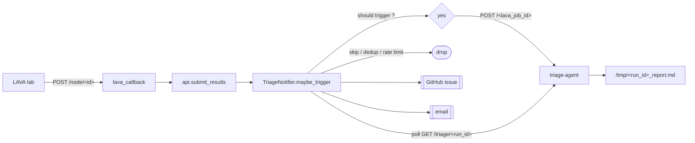

When a LAVA job fails, the pipeline can send it to a separate
[triage-agent](https://github.com/) service for automatic root-cause
analysis. The agent reads the LAVA log, runs a kernel triage skill
against it, and writes a Markdown report.

The handoff is best-effort. `lava_callback` submits the job and moves
on immediately — it never waits for the report, and a broken or
unreachable triage-agent never causes the LAVA callback to fail.

The report is always written to a file. It can also be posted as a
GitHub issue and/or emailed, if those are configured.

Sources:

- `src/triage_notifier.py` — the notifier module
- `src/lava_callback.py` — the callback that hooks the notifier

## Overview

`lava_callback` receives the LAVA callback, uploads log and artifacts
to storage, submits the results to the KernelCI API, and then calls
into the notifier. The notifier does nothing unless `TRIAGE_ENABLE=true`
and `TRIAGE_AGENT_URL` are set, so the integration is safe by default.

## When it fires

The notifier looks at the finished LAVA job and decides whether to
dispatch:

| Job result | Any test failed | Infra error | Dispatch |
|---|---|---|---|
| `pass` | no | — | no |
| `pass` | yes | — | **yes** |
| `fail` | — | — | **yes** |
| `incomplete` | — | no | **yes** |
| `incomplete` | — | yes | no by default; **yes** if `TRIAGE_SKIP_INFRA_ERRORS=false` |

Even when the criteria say "dispatch", the notifier can still drop the
run:

- **Dedup** — the same `node_id` was triaged within the last
  `TRIAGE_NODE_DEDUP_TTL_SEC` (default 3600s).
- **Rate cap** — `TRIAGE_MAX_PER_HOUR` limits dispatches per rolling
  hour. 0 = unlimited (default).
- **Back-pressure** — the notifier's own thread pool is full.

Back-pressure is checked before dedup and rate cap, so a dropped run
does not burn a dedup slot or a rate-limit token.

## Configuration

All environment variables. Read once when `lava_callback` starts.

### Enable and target

| Var | Default | Notes |
|---|---|---|
| `TRIAGE_ENABLE` | `false` | Master switch |
| `TRIAGE_AGENT_URL` | — | Base URL of the triage-agent |
| `TRIAGE_POLL_INTERVAL_SEC` | `15` | Delay between status polls |
| `TRIAGE_AGENT_TIMEOUT_SEC` | `2100` | How long to wait for the agent. Must be longer than the agent's own timeout so the agent's error message wins |

### Filtering

| Var | Default | Notes |
|---|---|---|
| `TRIAGE_SKIP_INFRA_ERRORS` | `true` | Set to `false` to also triage jobs marked as infrastructure failures |

### Concurrency and de-duplication

| Var | Default | Notes |
|---|---|---|
| `TRIAGE_MAX_WORKERS` | `4` | Notifier's own thread pool |
| `TRIAGE_MAX_QUEUE` | `MAX_WORKERS × 4` | Back-pressure threshold |
| `TRIAGE_NODE_DEDUP_TTL_SEC` | `3600` | Per-node cooldown, in seconds |
| `TRIAGE_MAX_PER_HOUR` | `0` | Cap dispatches per rolling hour. 0 disables the cap |

### Model overrides

| Var | Default | Notes |
|---|---|---|
| `TRIAGE_MODEL` | agent's default | LiteLLM model string sent per request |
| `TRIAGE_MODEL_OPTIONS_JSON` | — | JSON object merged into `litellm.completion(...)` |
| `TRIAGE_KERNELCI_WEB_URL` | — | Web root for node links in the report header |

### Delivery (all optional)

The report file is always written locally. Set the vars below to also
deliver via GitHub or email.

GitHub — opens a new issue on the first hit for a `node_id`, comments
on it for retriggers:

| Var | Default | Notes |
|---|---|---|
| `TRIAGE_GITHUB_REPO` | — | `owner/repo` |
| `TRIAGE_GITHUB_TOKEN` | — | PAT with `issues:write` |
| `TRIAGE_GITHUB_LABELS` | `triage,lava-failure` | Comma-separated |

SMTP:

| Var | Default | Notes |
|---|---|---|
| `TRIAGE_SMTP_HOST` | — | Enable email by also setting `_FROM` and `_TO` |
| `TRIAGE_SMTP_PORT` | `587` | STARTTLS if 587, implicit TLS if 465 |
| `TRIAGE_SMTP_USER` | — | Omit for unauthenticated relays |
| `TRIAGE_SMTP_PASSWORD` | — | Auth password |
| `TRIAGE_SMTP_FROM` | — | `From:` address |
| `TRIAGE_EMAIL_TO` | — | Comma-separated recipients |
| `TRIAGE_EMAIL_CC` | — | Comma-separated Cc |

### Operator knobs on `lava_callback`

| Var | Default | Notes |
|---|---|---|
| `CALLBACK_DRY_RUN` | `false` | Skip storage upload and API submit inside `async_job_submit` — the flow still reaches the notifier. **Test-only** |

## Design notes

### Never break the callback

`maybe_trigger` catches every exception it can produce and returns
immediately. All work happens on the notifier's own thread pool.
`lava_callback` also wraps the call in its own try/except as a second
line of defence. The LAVA callback path stays green even if triage is
misconfigured or the agent is offline.

### Two timeouts, one authoritative

`TRIAGE_AGENT_TIMEOUT_SEC` (client, in the notifier) and
`TRIAGE_RUN_TIMEOUT_SEC` (server, in the agent) both bound how long a
triage run can take. The client's clock starts first — it includes the
submit round-trip and the agent's log fetch — so if the two limits are
equal, the client times out first and reports a generic `"timeout"`.
Keep the client timeout larger so the server's specific error
(`"run exceeded run_timeout_sec"`) reaches the operator. The default
2100s = 1800s + 5min slack.

### Back-pressure uses an atomic counter

The notifier tracks queued + running work with its own counter, not
the private `ThreadPoolExecutor._work_queue.qsize()`. The private
attribute is not part of the CPython contract and can move between
versions. The counter also makes it easy to expose an in-flight gauge
later.

### Ordering: back-pressure before dedup

The pool-full check happens before dedup and rate cap. Dedup is
expensive to undo — if a run dropped by back-pressure still burned a
dedup slot, the same node could not be retriaged for an hour after a
burst. Cheap checks first.

### Best-effort delivery

GitHub and email are called serially after the poll returns. Each has
its own try/except, so a failure in one does not block the other.
Outcomes bump metric counters (`triage_github_created_total`,
`triage_email_sent_total`, etc.).

## Related documents

- [`connecting-lab.md`](connecting-lab.md) — how a LAVA lab is wired
  to the pipeline (LAVA token, `notify.callback` block)
- [`pipeline-details.md`](pipeline-details.md) — the end-to-end
  pipeline flow that produces the callback events the notifier acts on
